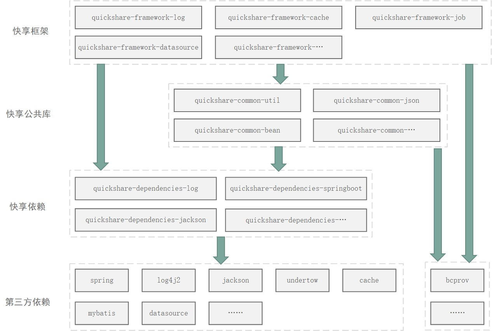
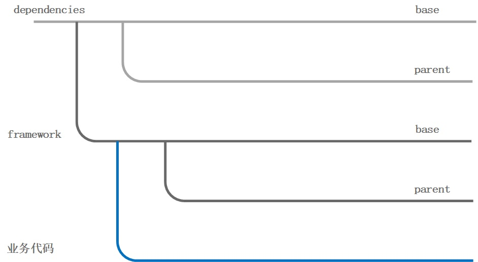

# 框架说明

## 开发环境

JDK:1.8  
Maven:3.3.9  
IDE:idea，VS Code  

## 整体引用关系

第三方依赖 --> 快享依赖 --> 快享框架(包括公共库) --> (starters) --> 业务应用。  
- 快享依赖是第三方依赖按插件进行的整合，譬如日志依赖`quickshare-dependencies-log`，包含了第三方依赖`org.slf4j:slf4j-api`、
`spring-boot-starter-log4j2`等相关日志依赖。  
- starters是快享框架与相关依赖的整合，更方便业务引用。

## 版本管理

依赖版本 --> 框架版本 --> 应用版本

